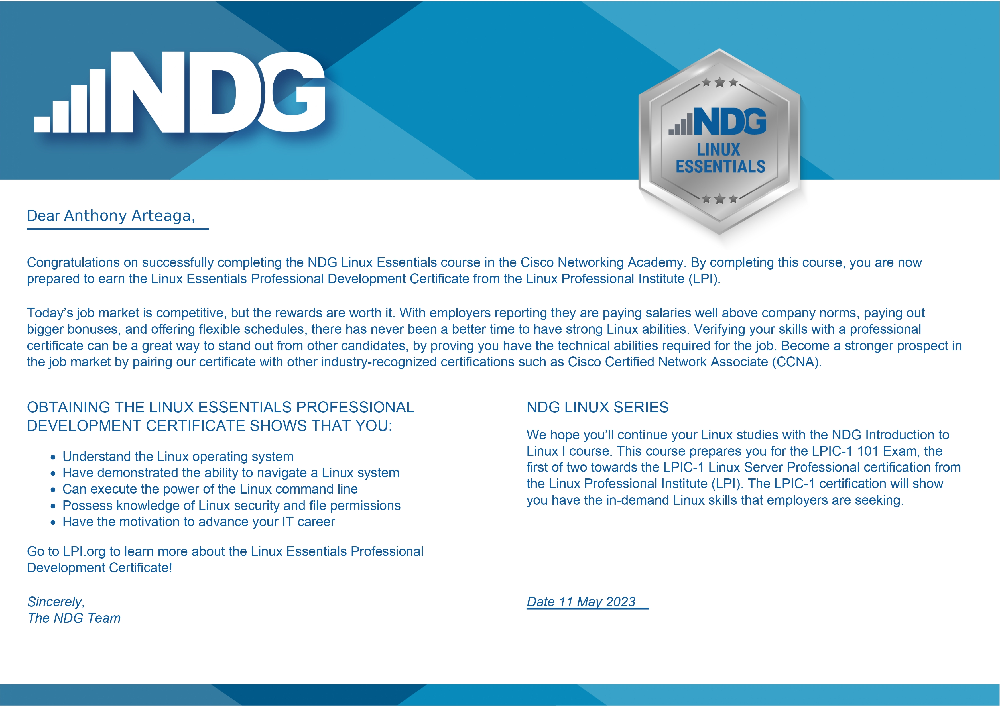
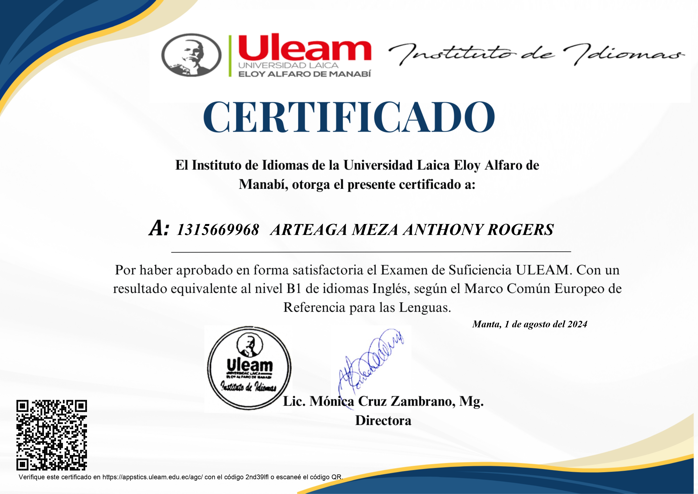
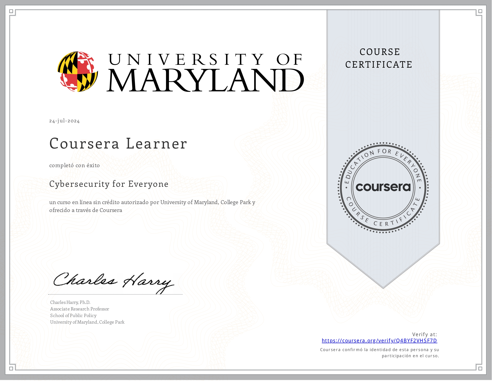

# ✨ Anthonyx57 Full-Stack Developer ✨

## Sobre mi

Soy un desarrollador Full-Stack graduado como Ingeniero en Tecnologias de la informacion 💻 Me decanto mucho por el desarrollo back end y la logica de los programas, los microservicios, autenticaciones y API's💻 . Interesado en los desarrollos y proyectos😊

## Areas de Interes

<table align="center">
  <tr>
    <td>Desarrollo BackEnd</td>
    <td>API's</td>
    <td>Containers</td>
  </tr>
  <tr>
    <td>Microservicios</td>
    <td>Modelado de DB</td>
    <td>Desarrollo FullStack</td>
  </tr>
</table>

## Habilidades

<table align="center">
  <tr>
    <td>
      
Lenguajes

    </td>
    <td> 
Frameworks
 </td>
    <td> 
Tecnologias
 </td>
  </tr>
  <tr>
    <td>

        
      
</td>
    <td>

        
      
</td>
    <td>

        
      
</td>
  </tr>
</table>

## Titulos/Certificados
<table align="center">
  <tr>
    <td> 
      
Linux Essentials
 
      

        
      

    </td>
    <td>
      
Ingles B1

      

        
      

    </td>
    <td>
      
Ciber Seguridad

      
      

    </td>
  </tr>
</table>

## Redes

  

    
     www.linkedin.com/in/anthonyx57
  

  

    
     antrogartme2002@gmail.com
  

